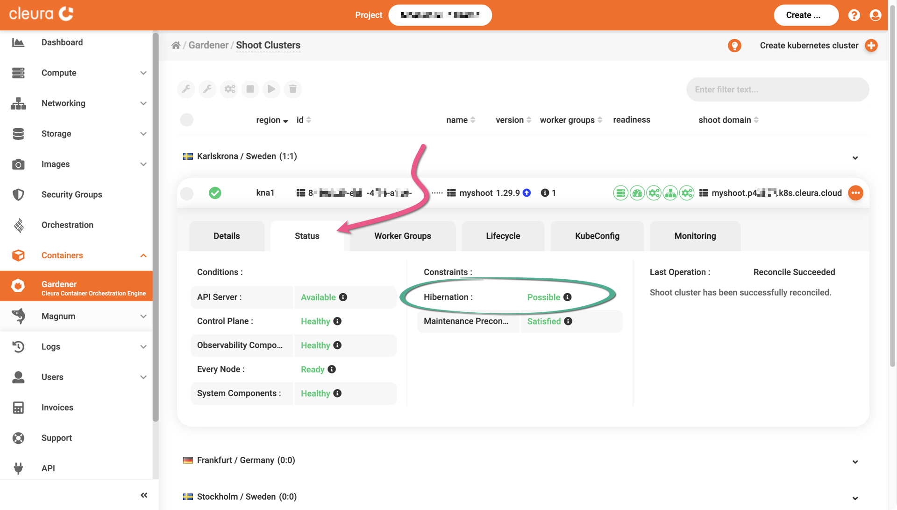
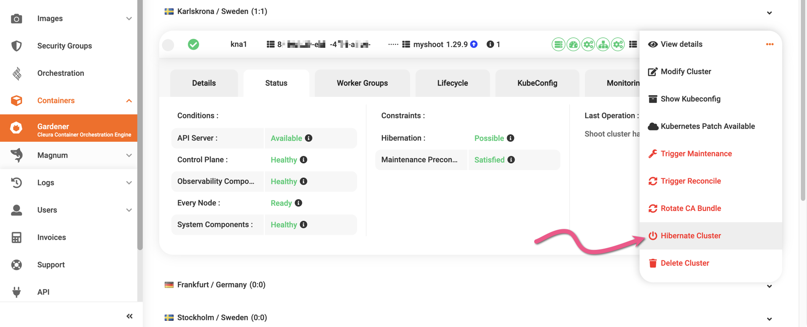

# Hibernating a Kubernetes cluster

There will be times when you won't be using your {{k8s_management_service}}-based cluster much, if at all.
To save on costs, you can put the whole cluster in hibernation.
If you do, then from that time on (and until you wake the cluster again), you will be paying *less* for the cluster.

## Prerequisites

We assume you have already used {{brand_container_orchestration}} to spin up a Kubernetes cluster, which is now humming away.
If you've never done this before, please feel free to [follow this guide](create-shoot-cluster.md).

## Hibernating a cluster

Fire up your favorite web browser and navigate to <https://{{gui_domain}}>.
Make sure the vertical pane at the left-hand side of the page is in full view, then choose *Containers → [{{k8s_management_service}}](https://{{gui_domain}}/containers/gardener)*.
In the main pane, you will see your {{k8s_management_service}} cluster.
Click anywhere on its row for a detailed view of the various cluster characteristics.
Bring up the *Status* tab and, in the *Constraints* section, check whether hibernation is possible.
In the example below we have a shoot cluster based on Kubernetes 1.29, the latest supported at the time of this writing, and hibernation is indeed possible.

To go ahead and actually hibernate the cluster, click the orange :material-dots-horizontal-circle: icon at the right-hand side of the cluster row.
From the pop-up menu that appears, select *Hibernate Cluster*.

A big pop-up window labeled *About to hibernate a gardener shoot* appears, asking you to confirm the action.
Click the red button labeled *Yes, Hibernate*.

The cluster will begin hibernating.
The animated icon at the left-hand side of the cluster row marks the progress.

After a minute or two, the cluster will be in a hibernated state.
This fact will be indicated by the red :material-stop-circle: icon, again at the left-hand side of the cluster row.

From this point on, and as long as the cluster is in hibernation, any attempt to list the cluster nodes, e.g., via `kubectl`, will fail.

## Waking up a cluster in hibernation

To wake up a cluster in hibernation, click the orange :material-dots-horizontal-circle: icon at the right-hand side of its row.
From the pop-up menu that appears, select *Wake up Cluster*.

A big pop-up window labeled *About to wakeup a gardener shoot* appears, asking you to confirm that you want to wake the cluster.
Go ahead and click the red *Yes, Wakeup* button.

The cluster will start waking up.
Again, the animated icon at the left-hand side of the cluster row marks the progress.

After a couple of minutes, the cluster will be fully awake.
The fact will be indicated by the green :material-check-circle: icon, at the left-hand side of the cluster row.

From that time on, the cluster will be fully operational and accessible again.
