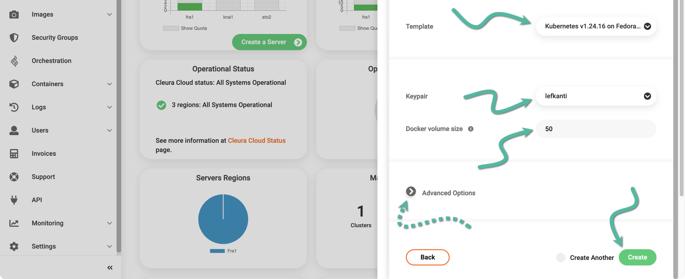
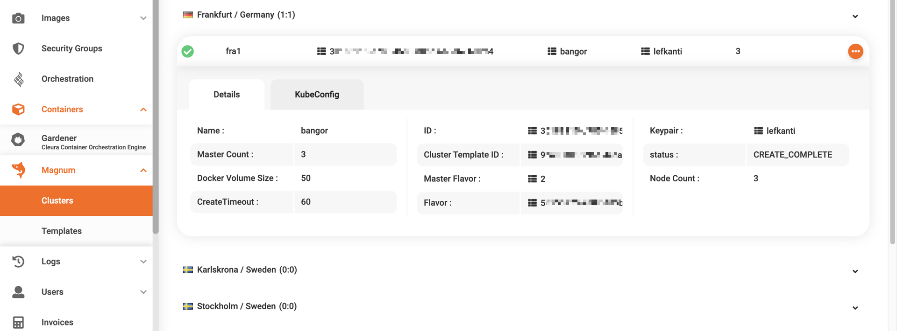

# Creating a Kubernetes cluster

By employing OpenStack
[Magnum](https://docs.openstack.org/magnum/latest) you can create
Kubernetes clusters via OpenStack, using the {{gui}} or the OpenStack
CLI.

## Prerequisites

First and foremost, you need an [account in
{{brand}}](../../getting-started/create-account.md). Should you choose to
work from your terminal, you will also need to [enable the OpenStack
CLI](../../getting-started/enable-openstack-cli.md). In that case, in
addition to the Python `openstackclient` module, make sure you also
install the corresponding plugin module for Magnum. Use either the
package manager of your operating system or `pip`:

=== "Debian/Ubuntu"
    ```bash
    apt install python3-magnumclient
    ```
=== "Mac OS X with Homebrew"
    This Python module is unavailable via `brew`, but you can install it
    via `pip`.
=== "Python Package"
    ```bash
    pip install python-magnumclient
    ```

## Creating a Kubernetes cluster

=== "{{gui}}"
    Fire up your favorite web browser, navigate to the
    [{{gui}}](https://{{gui_domain}}) start page, and log into your
    {{brand}} account. On the top right-hand side of the {{gui}}, click the
    *Create* button. A new pane titled *Create* slides into view.

    

    You will notice several rounded boxes on that pane, each for defining,
    configuring, and instantiating a different {{brand}} object. Go ahead
    and click the *Magnum Cluster* box. A new vertical pane titled *Create a
    Magnum Cluster* slides over. At the top, type in a name for the new
    cluster and select one of the available regions.

    

    A bit further below, use the drop-down menus to select a template and a
    keypair for the cluster nodes. Then, click the green *Create* button.

    

    The cluster creation process begins and takes some time to complete.
    While waiting, bring the vertical pane on the left-hand side of the
    {{gui}} in full view, select *Magnum* → *Clusters*, and in the main
    pane, take a look at the creation progress. You can tell when the whole
    process is complete by the icon at the left of the cluster row, or by
    the text in the *Status* column.

    
=== "OpenStack CLI"
    A simple, general command for creating a new Kubernetes cluster with
    Magnum looks like this:

    ```bash
    openstack coe cluster create \
        --cluster-template $CLUSTER_TMPL \
        --keypair $KEYPAIR \
        $CLUSTER_NAME
    ```

    You can now list all available templates in the region:

    ```bash
    openstack coe cluster template list
    ```

    ```plain
    +--------------------------------------+----------------------------------------------------------------+------+
    | uuid                                 | name                                                           | tags |
    +--------------------------------------+----------------------------------------------------------------+------+
    | 3f476f01-b3de-4687-a188-6829ed947db0 | Kubernetes 1.15.5 on Fedora-atomic 29 4C-8GB-20GB No Master LB | None |
    | c458f02d-54b0-4ef8-abbc-e1c25b61165a | Kubernetes 1.15.5 on Fedora-atomic 29 2C-4GB-20GB No Master LB | None |
    | f9e1a2ea-b1ff-43e7-8d1e-6dd5861b82cf | Kubernetes 1.18.6 on Fedora-coreos 33 2C-4GB-20GB No Master LB | None |
    +--------------------------------------+----------------------------------------------------------------+------+
    ```

    Select the template you want by setting the corresponding `uuid`
    value to the  `CLUSTER_TMPL` variable:

    ```bash
    CLUSTER_TMPL="f9e1a2ea-b1ff-43e7-8d1e-6dd5861b82cf" # just an example
    ```

    Then, list all available keypairs...

    ```bash
    openstack keypair list
    ```

    ```plain
    +---------+-------------------------------------------------+------+
    | Name    | Fingerprint                                     | Type |
    +---------+-------------------------------------------------+------+
    | husavik | 34:3b:58:ba:ec:95:f5:17:17:df:04:38:11:89:e6:3d | ssh  |
    +---------+-------------------------------------------------+------+
    ```

    ...and set the `KEYPAIR` variable to the name of the keypair you
    want:

    ```bash
    KEYPAIR="husavik" # again, this is just an example
    ```

    Finally, decide on a name for your new Kubernetes cluster:

    ```bash
    CLUSTER_NAME="bangor"
    ```

    With everything in place, go ahead and create your new Kubernetes
    cluster:

    ```bash
    openstack coe cluster create \
        --cluster-template $CLUSTER_TMPL \
        --keypair husavik
        bangor
    ```

    If everything went well with your request for a new cluster, on your
    terminal, you would see a message like the following:

    ```plain
    Request to create cluster e0df8c62-c6f6-4c7d-b67e-33e3606e9ab6 accepted
    ```

    The cluster creation process takes some time to complete, and while
    you are waiting, you can check if everything is progressing smoothly:

    ```bash
    openstack coe cluster list -c status
    ```

    If everything is going well, the message you will get will be
    `CREATE_IN_PROGRESS`. When Magnum has finished creating the cluster, the
    message will be `CREATE_COMPLETE`.

## Viewing the Kubernetes cluster

After the Kubernetes cluster is ready, you may at any time view it and
get detailed information about it.

=== "{{gui}}"
    Bring the vertical pane on the left-hand side of the {{gui}} in full
    view, then select *Magnum* → *Clusters*. In the main pane, take a look
    at the row of the cluster you are interested in. In our example, there
    is only one cluster, hence only one row.

    

    To get more information on the cluster, just click on its row.
    Then, all relative information is displayed below the row.

    
=== "OpenStack CLI"
    To list all available Kubernetes clusters, type:

    ```bash
    openstack coe cluster list
    ```

    ```plain
    +---------------+--------+---------+------------+--------------+---------------+---------------+
    | uuid          | name   | keypair | node_count | master_count | status        | health_status |
    +---------------+--------+---------+------------+--------------+---------------+---------------+
    | e0df8c62-c6f6 | bangor | husavik |          1 |            1 | CREATE_COMPLE | HEALTHY       |
    | -4c7d-b67e-33 |        |         |            |              | TE            |               |
    | e3606e9ab6    |        |         |            |              |               |               |
    +---------------+--------+---------+------------+--------------+---------------+---------------+
    ```

    For many more details on a specific cluster, note its name and run a
    command like this:

    ```bash
    openstack coe cluster show bangor
    ```

    ```plain
    +----------------------+---------------------------------------------------------------------------+
    | Field                | Value                                                                     |
    +----------------------+---------------------------------------------------------------------------+
    | status               | CREATE_COMPLETE                                                           |
    | health_status        | HEALTHY                                                                   |
    | cluster_template_id  | f9e1a2ea-b1ff-43e7-8d1e-6dd5861b82cf                                      |
    | node_addresses       | ['192.0.2.105']                                                           |
    | uuid                 | e0df8c62-c6f6-4c7d-b67e-33e3606e9ab6                                      |
    | stack_id             | e3725aed-f665-4e8d-9409-85f5ee5e2f4a                                      |
    | status_reason        | None                                                                      |
    | created_at           | 2022-11-14T07:32:02+00:00                                                 |
    | updated_at           | 2022-11-14T07:37:26+00:00                                                 |
    | coe_version          | v1.18.6                                                                   |
    | labels               | {'kube_tag': 'v1.18.6', 'heat_container_agent_tag': 'train-stable'}       |
    | labels_overridden    | {}                                                                        |
    | labels_skipped       | {}                                                                        |
    | labels_added         | {}                                                                        |
    | fixed_network        | None                                                                      |
    | fixed_subnet         | None                                                                      |
    | floating_ip_enabled  | True                                                                      |
    | faults               |                                                                           |
    | keypair              | husavik                                                                   |
    | api_address          | https://192.0.2.136:6443                                                  |
    | master_addresses     | ['192.0.2.136']                                                           |
    | master_lb_enabled    | False                                                                     |
    | create_timeout       | 60                                                                        |
    | node_count           | 1                                                                         |
    | discovery_url        | https://discovery.etcd.io/23af721dc3ee773d2674db4881ff70cb                |
    | docker_volume_size   | 50                                                                        |
    | master_count         | 1                                                                         |
    | container_version    | 1.12.6                                                                    |
    | name                 | bangor                                                                    |
    | master_flavor_id     | 2C-4GB-20GB                                                               |
    | flavor_id            | 2C-4GB-20GB                                                               |
    | health_status_reason | {'bangor-id6nijycp2wy-master-0.Ready': 'True', 'bangor-id6nijycp2wy-      |
    |                      | node-0.Ready': 'True', 'api': 'ok'}                                       |
    | project_id           | dfc700467396428bacba4376e72cc3e9                                          |
    +----------------------+---------------------------------------------------------------------------+
    ```

## Interacting with your cluster

Once your new Magnum-managed Kubernetes cluster is operational, you can [start interacting with it](kubectl.md).
