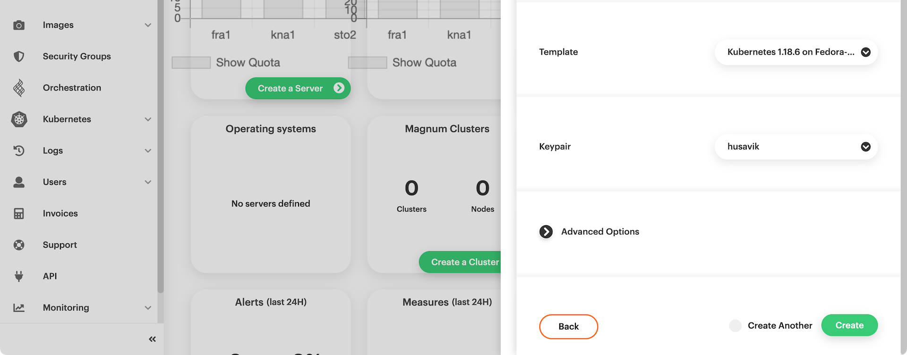
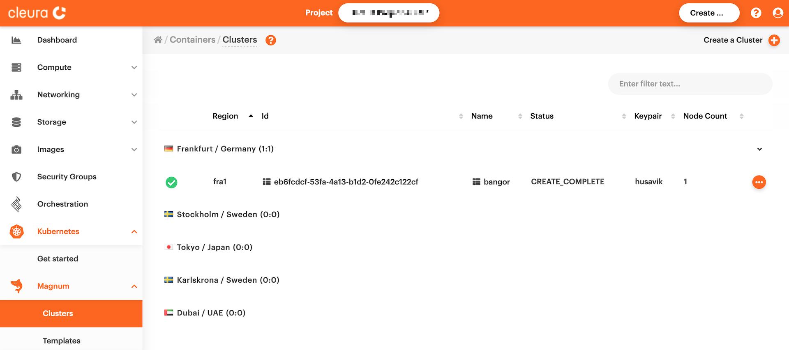
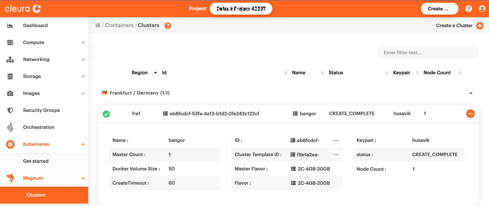

# Creating new Kubernetes clusters

By employing OpenStack [Magnum](https://docs.openstack.org/magnum/latest) you can create Kubernetes clusters via OpenStack, using either the {{gui}} or the OpenStack CLI.
This guide covers the creation of a Kubernetes cluster following both approaches.

## Prerequisites

First and foremost, you need an [account in {{brand}}](/howto/getting-started/create-account).
If you prefer to work with the OpenStack CLI, go ahead and [enable it first](/howto/getting-started/enable-openstack-cli).
Then, in addition to the Python `openstackclient` module, make sure you also install the corresponding plugin module for Magnum.
Use either the package manager of your operating system or `pip`:

=== "Debian/Ubuntu"
    ```bash
    apt install python3-magnumclient
    ```
=== "Mac OS X with Homebrew"
    This Python module is unavailable via `brew`, but you can install it via `pip`.
=== "Python Package"
    ```bash
    pip install python-magnumclient
    ```

## Creating a Kubernetes cluster

To create a Kubernetes cluster from the {{gui}}, fire up your favorite web browser, navigate to the [{{gui}}](https://{{gui_domain}}) start page, and log into your {{brand}} account.
On the other hand, if you prefer to work with the OpenStack CLI, please do not forget to [source the RC file first](/howto/getting-started/enable-openstack-cli).

=== "{{gui}}"
    On the top right-hand side of the {{gui}}, click the _Create_ button.
    A new pane titled _Create_ will slide into view from the right-hand side of the browser window.

    

    You will notice several rounded boxes on that pane.
    Go ahead and click the one labeled _Magnum Cluster_.
    A new pane titled _Create a Magnum Cluster_ will slide over.
    At the top, type in a name for the new Kubernetes cluster and select one of the available regions.

    

    Then, select one of the available templates to base the new cluster on.
    In the example below, we have selected the template named _Kubernetes 1.18.6 on Fedora-coreos 33 2C-4GB-20GB No Master LB_.
    The naming of any template indicates the version of Kubernetes that is about to be deployed, the characteristics of the cluster nodes, the operating system they run, and the presence or not of a load balancer for the control plane.

    Optionally, select one of the available keypairs for secure SSH access to the individual cluster nodes.

    

    For now, you may skip the _Advanced Options_ section.

    Click the green _Create_ button, and Magnum will start creating the new Kubernetes cluster.
    Please note that the whole process may take several minutes to complete.
=== "OpenStack CLI"
    A simple, general command for creating a new Kubernetes cluster with Magnum looks like this:

    ```bash
    openstack coe cluster create \
        --cluster-template $CLUSTER_TMPL \
        --keypair $KEYPAIR \
        $CLUSTER_NAME
    ```

    You can now list all available templates in the region:

    ```bash
    openstack coe cluster template list
    ```

    ```plain
    +--------------------------------------+----------------------------------------------------------------+------+
    | uuid                                 | name                                                           | tags |
    +--------------------------------------+----------------------------------------------------------------+------+
    | 3f476f01-b3de-4687-a188-6829ed947db0 | Kubernetes 1.15.5 on Fedora-atomic 29 4C-8GB-20GB No Master LB | None |
    | c458f02d-54b0-4ef8-abbc-e1c25b61165a | Kubernetes 1.15.5 on Fedora-atomic 29 2C-4GB-20GB No Master LB | None |
    | f9e1a2ea-b1ff-43e7-8d1e-6dd5861b82cf | Kubernetes 1.18.6 on Fedora-coreos 33 2C-4GB-20GB No Master LB | None |
    +--------------------------------------+----------------------------------------------------------------+------+
    ```

    Select the template you want by setting the corresponding `uuid` value to the  `CLUSTER_TMPL` variable:

    ```bash
    CLUSTER_TMPL="f9e1a2ea-b1ff-43e7-8d1e-6dd5861b82cf" # just an example
    ```

    Then, list all available keypairs...

    ```bash
    openstack keypair list
    ```

    ```plain
    +---------+-------------------------------------------------+------+
    | Name    | Fingerprint                                     | Type |
    +---------+-------------------------------------------------+------+
    | husavik | 34:3b:58:ba:ec:95:f5:17:17:df:04:38:11:89:e6:3d | ssh  |
    +---------+-------------------------------------------------+------+
    ```

    ...and set the `KEYPAIR` variable to the name of the keypair you want:

    ```bash
    KEYPAIR="husavik" # again, this is just an example
    ```

    Finally, decide on a name for your new Kubernetes cluster:

    ```bash
    CLUSTER_NAME="bangor"
    ```

    With everything in place, go ahead and create your new Kubernetes cluster:

    ```bash
    openstack coe cluster create \
        --cluster-template $CLUSTER_TMPL \
        --keypair husavik
        bangor
    ```
    If everything went well with your request for a new cluster, on your terminal, you would see a message like the following:

    ```plain
    Request to create cluster e0df8c62-c6f6-4c7d-b67e-33e3606e9ab6 accepted
    ```

    The cluster creation process takes some time to complete, and while you are waiting, you can check if everything is progressing smoothly:

    ```bash
    openstack coe cluster list -c status
    ```

    If everything is going well, the message you will get will be `CREATE_IN_PROGRESS`.
    When Magnum has finished creating the cluster, the message will be `CREATE_COMPLETE`.

## Viewing the Kubernetes cluster

After the Kubernetes cluster is ready, you may at any time view it and get detailed information about it.

=== "{{gui}}"
    In the left vertical pane of the {{gui}}, click through _Kubernetes_, _Magnum_, and _Clusters_.
    In the central pane on the right, you will then see all your Kubernetes clusters in every region.

    

    Click on the three-dot icon on the right of the cluster you want to inspect, and select _View details_.

    
=== "OpenStack CLI"
    To list all available Kubernetes clusters, type:

    ```bash
    openstack coe cluster list
    ```

    ```plain
    +---------------+--------+---------+------------+--------------+---------------+---------------+
    | uuid          | name   | keypair | node_count | master_count | status        | health_status |
    +---------------+--------+---------+------------+--------------+---------------+---------------+
    | e0df8c62-c6f6 | bangor | husavik |          1 |            1 | CREATE_COMPLE | HEALTHY       |
    | -4c7d-b67e-33 |        |         |            |              | TE            |               |
    | e3606e9ab6    |        |         |            |              |               |               |
    +---------------+--------+---------+------------+--------------+---------------+---------------+
    ```

    For many more details on a specific cluster, note its name and run a command like this:

    ```bash
    openstack coe cluster show bangor
    ```

    ```plain
    +----------------------+---------------------------------------------------------------------------+
    | Field                | Value                                                                     |
    +----------------------+---------------------------------------------------------------------------+
    | status               | CREATE_COMPLETE                                                           |
    | health_status        | HEALTHY                                                                   |
    | cluster_template_id  | f9e1a2ea-b1ff-43e7-8d1e-6dd5861b82cf                                      |
    | node_addresses       | ['192.0.2.105']                                                           |
    | uuid                 | e0df8c62-c6f6-4c7d-b67e-33e3606e9ab6                                      |
    | stack_id             | e3725aed-f665-4e8d-9409-85f5ee5e2f4a                                      |
    | status_reason        | None                                                                      |
    | created_at           | 2022-11-14T07:32:02+00:00                                                 |
    | updated_at           | 2022-11-14T07:37:26+00:00                                                 |
    | coe_version          | v1.18.6                                                                   |
    | labels               | {'kube_tag': 'v1.18.6', 'heat_container_agent_tag': 'train-stable'}       |
    | labels_overridden    | {}                                                                        |
    | labels_skipped       | {}                                                                        |
    | labels_added         | {}                                                                        |
    | fixed_network        | None                                                                      |
    | fixed_subnet         | None                                                                      |
    | floating_ip_enabled  | True                                                                      |
    | faults               |                                                                           |
    | keypair              | husavik                                                                   |
    | api_address          | https://192.0.2.136:6443                                                  |
    | master_addresses     | ['192.0.2.136']                                                           |
    | master_lb_enabled    | False                                                                     |
    | create_timeout       | 60                                                                        |
    | node_count           | 1                                                                         |
    | discovery_url        | https://discovery.etcd.io/23af721dc3ee773d2674db4881ff70cb                |
    | docker_volume_size   | 50                                                                        |
    | master_count         | 1                                                                         |
    | container_version    | 1.12.6                                                                    |
    | name                 | bangor                                                                    |
    | master_flavor_id     | 2C-4GB-20GB                                                               |
    | flavor_id            | 2C-4GB-20GB                                                               |
    | health_status_reason | {'bangor-id6nijycp2wy-master-0.Ready': 'True', 'bangor-id6nijycp2wy-      |
    |                      | node-0.Ready': 'True', 'api': 'ok'}                                       |
    | project_id           | dfc700467396428bacba4376e72cc3e9                                          |
    +----------------------+---------------------------------------------------------------------------+
    ```

## Accessing the Kubernetes cluster with kubectl

You may install the Kubernetes command line tool, `kubectl`, on your local computer, and run commands against your cluster.
To install `kubectl`, use the package manager of your operating system.

=== "Debian/Ubuntu"
    ```bash
    apt install kubectl
    ```
=== "Mac OS X with Homebrew"
    ```bash
    brew install kubectl
    ```

Before running commands against a specific cluster, you must have the corresponding [kubeconfig](https://kubernetes.io/docs/concepts/configuration/organize-cluster-access-kubeconfig/) file on your computer.

=== "{{gui}}"
    Downloading a kubeconfig file from the {{gui}} is currently not supported.
    You can still fetch the kubeconfig file for your newly created Kubernetes cluster using the OpenStack CLI.
=== "OpenStack CLI"
    To download the kubeconfig file for your Kubernetes cluster, type the following:

    ```bash
    openstack coe cluster config --dir=${PWD} bangor
    ```

After saving the kubeconfig file locally, set the value of variable `KUBECONFIG` to the full path of the file.
Type, for example:

```bash
export KUBECONFIG=${PWD}/config
```

Then, you can use `kubectl` to run commands against your cluster.
See, for instance, all cluster nodes ...

```bash
kubectl get nodes
```

```plain
NAME                           STATUS   ROLES    AGE    VERSION
bangor-id6nijycp2wy-master-0   Ready    master   113m   v1.18.6
bangor-id6nijycp2wy-node-0     Ready    <none>   111m   v1.18.6
```

... or all running pods in every namespace:

```bash
kubectl get pods --all-namespaces
```

```plain
NAMESPACE     NAME                                         READY   STATUS    RESTARTS   AGE
kube-system   coredns-786ffb7797-tw2hg                     1/1     Running   0          167m
kube-system   coredns-786ffb7797-vbqwn                     1/1     Running   0          167m
kube-system   csi-cinder-controllerplugin-0                5/5     Running   0          167m
kube-system   csi-cinder-nodeplugin-4nr69                  2/2     Running   0          166m
kube-system   csi-cinder-nodeplugin-vtwqf                  2/2     Running   0          167m
kube-system   dashboard-metrics-scraper-6b4884c9d5-4mlrg   1/1     Running   0          167m
kube-system   k8s-keystone-auth-wk5v2                      1/1     Running   0          167m
kube-system   kube-dns-autoscaler-75859754fd-2wsd9         1/1     Running   0          167m
kube-system   kube-flannel-ds-7z9dp                        1/1     Running   0          167m
kube-system   kube-flannel-ds-dmvk6                        1/1     Running   0          166m
kube-system   kubernetes-dashboard-c98496485-stn42         1/1     Running   0          167m
kube-system   magnum-metrics-server-79556d6999-xdlpm       1/1     Running   0          167m
kube-system   npd-5p6gk                                    1/1     Running   0          165m
kube-system   openstack-cloud-controller-manager-44rz9     1/1     Running   0          167m
```
