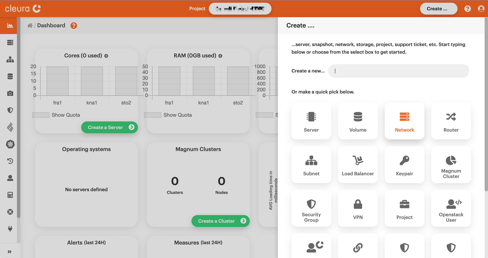
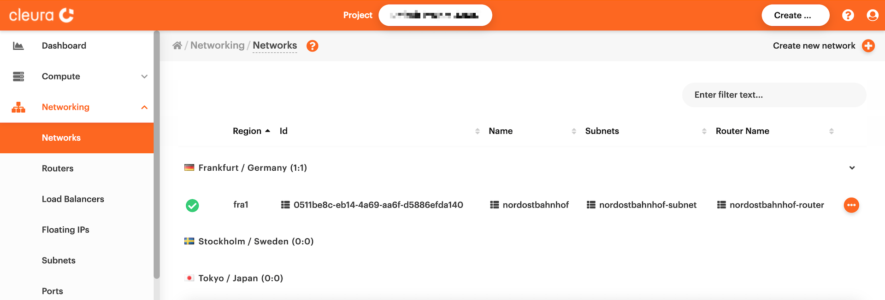
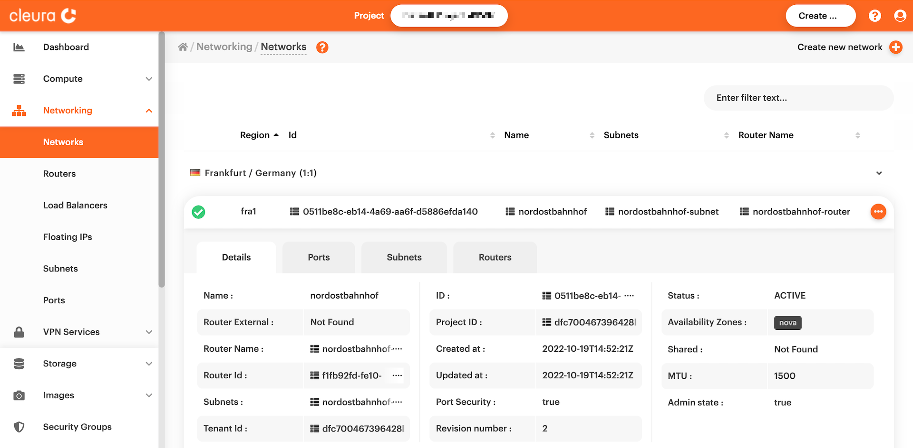

# Creating new networks in Cleura Cloud

Before creating a server in {{brand}} Cloud, you need at least
one network to make the new server a member of. Since you may have
more than one network per region, let us now walk through creating
a new network using the {{gui}}, or using the OpenStack CLI.

## Prerequisites

Whether you choose to work from the {{gui}} or with the
OpenStack CLI, you need to [have an account](/howto/getting-started/create-account)
in {{brand}} Cloud. Additionally, to use the OpenStack
CLI make sure to [enable it first](/howto/getting-started/enable-openstack-cli).

## Creating a network

To create a network from the {{gui}}, fire up your favorite web
browser, navigate to the [Cleura Cloud](https://{{gui_domain}})
page, and login into your {{brand}} account. On the other hand,
if you prefer to work with OpenStack CLI, please do not forget to
source the RC file first.

=== "{{gui}}"
    On the top right-hand side of the {{gui}}, click the _Create_
    button. A new pane will slide into view from the right-hand side of
    the browser window, titled _Create_.

    

    You will notice several rounded boxes prominently displayed on that
    pane, each for defining, configuring, and instantiating a different
    {{brand}} Cloud object. Go ahead and click the _Network_ box. A
    new pane titled _Create Network_ will slide over. At the top, type
    in a name and select one of the available regions for the new
    network.

    
=== "OpenStack CLI"
    Start by creating a new network, named `nordostbahnhof`:

    ```bash
    openstack network create nordostbahnhof
    ```

    By issuing the command above, you immediately get information
    regarding the new network:

    ```plain
    +---------------------------+--------------------------------------+
    | Field                     | Value                                |
    +---------------------------+--------------------------------------+
    | admin_state_up            | UP                                   |
    | availability_zone_hints   |                                      |
    | availability_zones        |                                      |
    | created_at                | 2022-10-30T14:31:49Z                 |
    | description               |                                      |
    | dns_domain                | None                                 |
    | id                        | 201d458b-9b47-4408-9736-980bec77d405 |
    | ipv4_address_scope        | None                                 |
    | ipv6_address_scope        | None                                 |
    | is_default                | False                                |
    | is_vlan_transparent       | None                                 |
    | mtu                       | 1500                                 |
    | name                      | nordostbahnhof                       |
    | port_security_enabled     | True                                 |
    | project_id                | dfc700467396428bacba4376e72cc3e9     |
    | provider:network_type     | None                                 |
    | provider:physical_network | None                                 |
    | provider:segmentation_id  | None                                 |
    | qos_policy_id             | None                                 |
    | revision_number           | 1                                    |
    | router:external           | Internal                             |
    | segments                  | None                                 |
    | shared                    | False                                |
    | status                    | ACTIVE                               |
    | subnets                   |                                      |
    | tags                      |                                      |
    | updated_at                | 2022-10-30T14:31:50Z                 |
    +---------------------------+--------------------------------------+
    ```

## Adding a subnet and a router

Creating a new network does not necessarily mean it has all the
features you most likely would expect. Unless you work from the
{{gui}}, where almost every component is activated for you with
a few clicks here and there, when you use the OpenStack CLI there is
some extra work you need to do before you get a network you would
characterize as useful.

=== "{{gui}}"
    Expand the _Advanced Options_ section below, make sure _Port Security_
    is enabled, and leave the MTU parameter blank.

    

    You probably want a full-featured network for your cloud servers, so
    please activate the _Create a complete network containing a subnet
    and a router_ option. You will notice that [a network address in
    CIDR notation](https://en.wikipedia.org/wiki/Classless_Inter-Domain_Routing#CIDR_notation)
    is pre-configured for your network. You also get a couple of DNS
    servers, a Gateway, and a DHCP server.

    

    Scroll down a little bit if you have to. Assuming you want your cloud
    servers to reach hosts on the Internet, for the _External network_
    parameter make sure you select _ext-net_. Then, click the green
    _Create_ button to initialize the new network. In a few seconds,
    the new network will be readily available.

    
=== "OpenStack CLI"
    You now have to create a subnet for the new network. Let us call
    this subnet `nordostbahnhof-subnet`:

    ```bash
    openstack subnet create nordostbahnhof-subnet \
        --network nordostbahnhof --subnet-range 10.20.30.0/24
    ```

    Again, you get detailed information regarding the new subnet:

    ```plain
    +----------------------+--------------------------------------+
    | Field                | Value                                |
    +----------------------+--------------------------------------+
    | allocation_pools     | 10.20.30.2-10.20.30.254              |
    | cidr                 | 10.20.30.0/24                        |
    | created_at           | 2022-10-30T14:47:40Z                 |
    | description          |                                      |
    | dns_nameservers      |                                      |
    | dns_publish_fixed_ip | None                                 |
    | enable_dhcp          | True                                 |
    | gateway_ip           | 10.20.30.1                           |
    | host_routes          |                                      |
    | id                   | 1b0822b3-62e8-4b40-92e8-8544c72d4c15 |
    | ip_version           | 4                                    |
    | ipv6_address_mode    | None                                 |
    | ipv6_ra_mode         | None                                 |
    | name                 | nordostbahnhof-subnet                |
    | network_id           | 201d458b-9b47-4408-9736-980bec77d405 |
    | project_id           | dfc700467396428bacba4376e72cc3e9     |
    | revision_number      | 0                                    |
    | segment_id           | None                                 |
    | service_types        |                                      |
    | subnetpool_id        | None                                 |
    | tags                 |                                      |
    | updated_at           | 2022-10-30T14:47:40Z                 |
    +----------------------+--------------------------------------+
    ```

    If you want servers connected to the `nordostbahnhof` network to have
    Internet access, you need a router in front of the network. Following
    our unofficial naming convention, go ahead and create a new router
    called `nordostbahnhof-router`:

    ```bash
    openstack router create nordostbahnhof-router 
    ```

    As expected, you will see lots of information regarding the new router:

    ```plain
    +-------------------------+--------------------------------------+
    | Field                   | Value                                |
    +-------------------------+--------------------------------------+
    | admin_state_up          | UP                                   |
    | availability_zone_hints |                                      |
    | availability_zones      |                                      |
    | created_at              | 2022-10-30T15:36:26Z                 |
    | description             |                                      |
    | enable_ndp_proxy        | None                                 |
    | external_gateway_info   | null                                 |
    | flavor_id               | None                                 |
    | ha                      | True                                 |
    | id                      | 566de991-fc0e-4f85-b6c4-5c87694781f7 |
    | name                    | nordostbahnhof-router                |
    | project_id              | dfc700467396428bacba4376e72cc3e9     |
    | revision_number         | 1                                    |
    | routes                  |                                      |
    | status                  | ACTIVE                               |
    | tags                    |                                      |
    | tenant_id               | dfc700467396428bacba4376e72cc3e9     |
    | updated_at              | 2022-10-30T15:36:26Z                 |
    +-------------------------+--------------------------------------+
    ```

    You want the `nordostbahnhof-router` connected to the external
    network. The name of this network is `ext-net`:

    ```bash
    openstack router set nordostbahnhof-router --external-gateway ext-net
    ```

    Please note that if the command above is successful, you will get
    no output on your terminal. There is one last step to take, and
    that is to connect router `nordostbahnhof-router` to the subnet
    `nordostbahnhof-subnet` of network `nordostbahnhof`:

    ```bash
    openstack router add subnet nordostbahnhof-router nordostbahnhof-subnet
    ```

    Again, if the command above is successful, you will get no output.

## Listing networks and getting information

At any time, you may connect to the {{gui}}, list all networks
you have already created, and get detailed information for any of
these networks. Alternatively, you may get all that information using
the OpenStack CLI.

=== "{{gui}}"
    You may see all defined networks, in all supported regions, by
    selecting _Networking_ > _Networks_ (see the left-hand side pane
    on the {{gui}}).

    

    For more information regarding a specific network, click the
    corresponding three-dot icon (right-hand side) and select _View
    details_. Then, you can glance over all the details regarding the
    selected network's ports, subnets, and routers.

    
=== "OpenStack CLI"
    To list all available networks in a specific region, just type:

    ```bash
    openstack network list
    ```

    You can always ask for more specific results. For instance, to see
    all internal networks only, type the following:

    ```bash
    openstack network list --internal
    ```

    You can also get detailed information about a specific network:

    ```bash
    openstack network show nordostbahnhof
    ```

    At any time, type `openstack network list --help` or
    `openstack network show --help` to see how to get information
    regarding networks, and what specific pieces of information you
    can have.
