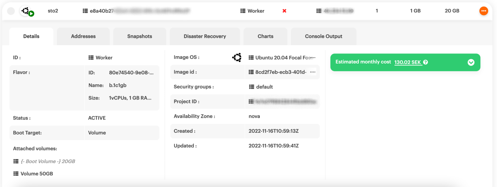
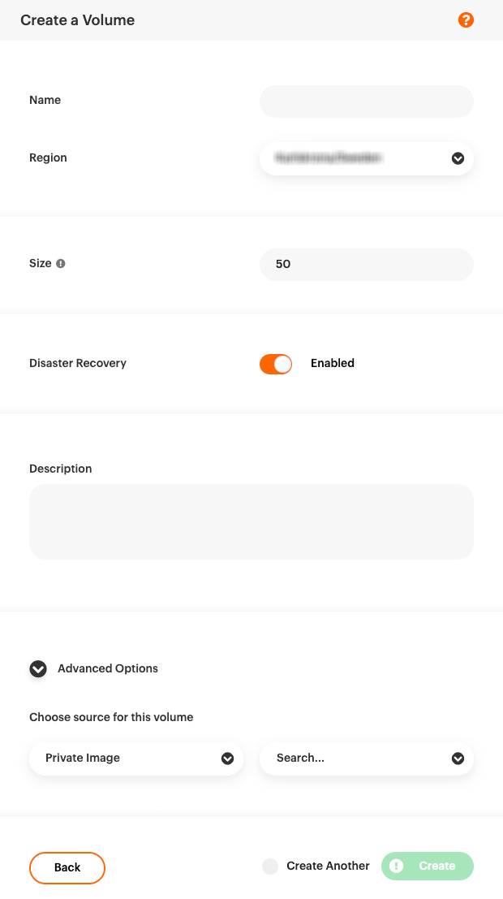

# Moving a server from one region to another

This guide will show you how to move a server to a different region in {{brand}}.

## Prerequisites

In order to move a server from one region to another, you will need

- a correctly installed and configured [OpenStack CLI client](../../getting-started/enable-openstack-cli.md),
- access to the RC files with credentials for both the source and target region,
- enough space on the local machine to be able to download an image of your server,
- a sufficiently configured target region including a [virtual network](../neutron/new-network.md) and necessary [security groups](../neutron/create-security-groups.md).

## Finding a volume's ID

=== "{{gui}}"
    To find your server's boot volume in the {{gui}}, open your web
    browser, navigate to the [{{gui}}](https://{{gui_domain}}), and log into your {{brand}} account.

    On the left side panel of the {{gui}} expand _Compute_, then click on _Servers_. 

    

    To get more details of the server you want to move, expand the view of the server by clicking it.

    

    On the left bottom side of the expanded view, there is a section called _Attached volumes:_. Below this you will see _{- Boot Volume -} <number\>GB_, click on it and then click _Copy ID_.

    > If your server does not have an attached volume with the prefix _{- Boot Volume -}_ then your server is not using boot from volume. This guide is only applicable to boot from volume servers.
=== "Openstack CLI"
    If you work with the OpenStack CLI, please do not forget to [source the RC file first](/howto/getting-started/enable-openstack-cli/).

    Use the ID of the server instead of using the server name. This will make sure that you are using the correct server.

    Find the ID of your server by matching the name, using the following command:

    ```bash
    openstack server list --name 'name'
    ```

    Printout reference:

    ```plain
    +-----------------+-----------------+---------+-----------------+--------------------+-------------+
    | ID              | Name            | Status  | Networks        | Image              | Flavor      |
    +-----------------+-----------------+---------+-----------------+--------------------+-------------+
    | 4E88215E-2DF9-4 | Name2           | SHUTOFF | STO2_test_netwo | N/A (booted from v | b.1c1gb     |
    | 9CA-8D39-31C01D |                 |         | rk=10.x.y.z     | olume)             |             |
    | 5B7EAE          |                 |         |                 |                    |             |
    | FAD16A17-A4F1-4 | Name1           | ACTIVE  | STO2_test_netwo | N/A (booted from v | b.1c1gb     |
    | 74C-9B90-DE14C8 |                 |         | rk=10.x.y.z     | olume)             |             |
    | AB8100          |                 |         |                 |                    |             |
    +-----------------+-----------------+---------+-----------------+--------------------+-------------+
    ```

    This guide is only applicable to servers that are using boot from volume. To verify this, make sure your server's `Image` value is `N/A (booted from volume)`.

    To get the ID of your server's boot volume, use the following command:

    ```bash
    openstack server show -c volumes_attached <server_id>
    ```

    Output:

    ```plain
    +------------------+-------------------------------------------+
    | Field            | Value                                     |
    +------------------+-------------------------------------------+
    | volumes_attached | id='14942b23-25EF-4181-9C54-E5C100E4EEB8' |
    |                  | id='34e2ca96-3C34-464F-AC66-9FEF7A6810B8' |
    |                  | id='68756558-DBF0-44DB-9475-1BC24822371C' |
    +------------------+-------------------------------------------+
    ```

    If there are multiple volumes attached, the first volume in the list is the server system volume. Copy this ID.

If you want to move any other attached volumes along with your server's system volume, you also need to follow the same steps for each one of these volumes.

## Stopping a running server

In the next step you are instructed to make a copy of the server's system volume. Some operating systems or applications might experience issues being copied at the same time it might be performing operations.

While this step is not strictly required, it is recommended to first power off your server by logging into it and shuting down the operation system. This can also be done with the {{gui}} or the OpenStack CLI.
=== "{{gui}}"
    In the top right-hand corner of the server panel, locate the menu button.

    

    Then click on _Stop Server_ in the list.

=== "Openstack CLI"
    Stop the running server with the following command:

    ```bash
    openstack server stop <server_id>
    ```

## Creating a copy of a volume

Begin by making a copy of the volume, using the following command:

```bash
openstack volume create --source <source_volume_id> <copy_volume_name>
```

You will get a printout showing you information about the created volume, such as `source_volid` which is the ID of volume you just copied, and `id` of this **new** volume, that you will use in the next step to create an image.

```plain
+---------------------+--------------------------------------+
| Field               | Value                                |
+---------------------+--------------------------------------+
| attachments         | []                                   |
| availability_zone   | nova                                 |
| bootable            | true                                 |
| consistencygroup_id | None                                 |
| created_at          | 2022-11-10T15:12:11.821647           |
| description         | None                                 |
| encrypted           | False                                |
| id                  | 2FDE1E6D-2D72-4D70-B12D-1A2D314DBA72 |
| multiattach         | False                                |
| name                | <copy_volume_name>                   |
| properties          |                                      |
| replication_status  | None                                 |
| size                | 20                                   |
| snapshot_id         | None                                 |
| source_volid        | 14942b23-25EF-4181-9C54-E5C100E4EEB8 |
| status              | creating                             |
| type                | default                              |
| updated_at          | None                                 |
| user_id             | 9E19-9424-42C4-B70F-A371EC0DB5D3     |
+---------------------+--------------------------------------+
```

## Creating an image of a volume

Then create an image of the copied volume, by using the following command:

```bash
openstack image create --volume <copy_volume_id> <new_image_name>
```

> Substitute `<copy_volume_id>` with the ID from the newly created volume in the previous step.

After a while you will get a printout showing you information of the new image, such as the image disk format `disk_format` and the image ID `image_id`, you need these two values in an upcoming step.

```plain
+---------------------+--------------------------------------+
| Field               | Value                                |
+---------------------+--------------------------------------+
| container_format    | bare                                 |
| disk_format         | raw                                  |
| display_description | None                                 |
| id                  | 2FDE1E6D-2D72-4D70-B12D-1A2D314DBA72 |
| image_id            | CFA8620A-52D7-4D84-91EF-B25BB24E6E33 |
| image_name          | <new_image_name>                     |
| protected           | False                                |
| size                | 20                                   |
| status              | uploading                            |
| updated_at          | 2022-11-10T15:22:12.000000           |
| visibility          | shared                               |
| volume_type         | default                              |
+---------------------+--------------------------------------+
```

Depending on the size of the volume it might take some time to upload and while it is, the image `status` will be `uploading`. Before you continue to the next step, make sure the image `status` is `active`, otherwise wait a bit and then check again with:

```bash
openstack image show -c status <image_id>
```

The printout should look like this before you continue.

```plain
+--------+--------+
| Field  | Value  |
+--------+--------+
| status | active |
+--------+--------+
```

> It is now safe to remove the volume you created earlier, using the command: `openstack volume delete <copy_volume_id>`

## Downloading an image

Download the image to your local computer, using the following command:

```bash
openstack image save --file <local_image_name>.<disk_format> <image_id>
```

> Substitute `<disk_format>` with the value from the printout in the previous step.  
> Substitute `<image_id>` with the ID from the printout in the previous step.

When you have downloaded the file, verify that the checksum of the file is the same as the `checksum` value of the image.

```bash
md5 <local_image_name>.<disk_format>
```

This will output the checksum of your local file.

```plain
MD5 (<local_image_name>.<disk_format>) = 4b086035a943cc1676583c0cc78f0896
```

Show the checksum of the image in the cloud, using the following command:

```bash
openstack image show -c checksum <image_id>
```

These two checksums should be the same.

```plain
+----------+----------------------------------+
| Field    | Value                            |
+----------+----------------------------------+
| checksum | 4b086035a943cc1676583c0cc78f0896 |
+----------+----------------------------------+
```

You are now done with the steps for the source region. The following steps will be done on the target region.

> It is now safe to remove the image you created earlier, using the command: `openstack image delete <image_id>`

## Uploading an image

Source the RC-file for the region you want to upload to.

```bash
source <target_region_openrc>
```

Upload the image to the new region. Set the correct disk format, input the path to the image file and select a name for the new image.

```bash
openstack image create --disk-format <disk_format> --file <local_image_name>.<disk_format> <new_image_name>
```

The upload will take some time, depending on your internet upload speed and the size of the image. When the upload is finished you get a printout displaying information about your image.

```plain
+------------------+-------------------------------------------------------------------------------+
| Field            | Value                                                                         |
+------------------+-------------------------------------------------------------------------------+
| container_format | bare                                                                          |
| created_at       | 2022-11-17T16:26:58Z                                                          |
| disk_format      | raw                                                                           |
| file             | /v2/images/DF4593A9-A4D4-46FE-9C82-1B8F88ECAC5D/file                          |
| id               | DF4593A9-A4D4-46FE-9C82-1B8F88ECAC5D                                          |
| min_disk         | 0                                                                             |
| min_ram          | 0                                                                             |
| name             | <new_image_name>                                                              |
| owner            | facabd68822643d19be8c9de84e27c49                                              |
| properties       | locations='[]', os_hidden='False', owner_specified.openstack.md5='',          |
|                  | owner_specified.openstack.object='images/<new_image_name>',                   |
|                  | owner_specified.openstack.sha256=''                                           |
| protected        | False                                                                         |
| schema           | /v2/schemas/image                                                             |
| status           | saving                                                                        |
| tags             |                                                                               |
| updated_at       | 2022-11-17T16:26:58Z                                                          |
| visibility       | shared                                                                        |
+------------------+-------------------------------------------------------------------------------+
```

But your image is not yet ready to use, {{brand}} still needs to process the file, which shouldn't take long. To check the status of the image, use the ID of the new image with the following command:

```bash
openstack image show <new_image_id>
```

```plain
+------------------+-------------------------------------------------------------------------------+
| Field            | Value                                                                         |
+------------------+-------------------------------------------------------------------------------+
| checksum         | 4b086035a943cc1676583c0cc78f0896                                              |
| container_format | bare                                                                          |
| created_at       | 2022-11-17T16:26:58Z                                                          |
| disk_format      | raw                                                                           |
| file             | /v2/images/DF4593A9-A4D4-46FE-9C82-1B8F88ECAC5D/file                          |
| id               | DF4593A9-A4D4-46FE-9C82-1B8F88ECAC5D                                          |
| min_disk         | 0                                                                             |
| min_ram          | 0                                                                             |
| name             | <new_image_name>                                                              |
| owner            | facabd68822643d19be8c9de84e27c49                                              |
| properties       | locations='[]', os_hidden='False', owner_specified.openstack.md5='',          |
|                  | owner_specified.openstack.object='images/<new_image_name>',                   |
|                  | owner_specified.openstack.sha256=''                                           |
| protected        | False                                                                         |
| schema           | /v2/schemas/image                                                             |
| status           | active                                                                        |
| tags             |                                                                               |
| updated_at       | 2022-11-17T16:26:58Z                                                          |
| visibility       | shared                                                                        |
+------------------+-------------------------------------------------------------------------------+
```

When the image's `status` value is `active`, the whole upload process is done.

Verify that the checksum of the new image is the same as your local file:

```bash
openstack image show -c checksum <new_image_id>
```

> It is now safe to remove the image file from your local computer.

## Creating a volume from an image

=== "{{gui}}"
    On the left side panel of the {{gui}} expand _Storage_, then click on _Volumes_.

    

    In the top right corner, find the button labeled _Create new volume_ and click on it.

    

    Select your target region and expand the _Advanced Options_ category, and select _Private Image_ as the source for the volume.

    

    Find the image for your volume in the dropdown list next to _Private Image_, fill in the name, description and size for the volume and click on _Create_.

=== "Openstack CLI"
    First you must choose the image you want to create a volume from.

    List all your private images with the following command:

    ```bash
    openstack image list --private
    ```

    Example printout:

    ```plain
    +--------------------------------------+--------------------------+--------+
    | ID                                   | Name                     | Status |
    +--------------------------------------+--------------------------+--------+
    | f9ce95de-564e-4f6e-ad0e-789c84f30b7c | <new_image_name>         | active |
    +--------------------------------------+--------------------------+--------+
    ```

    Then create the volume using the ID of the image in this command:

    ```bash
    openstack volume create --size <GB> --image <new_image_id> <new_volume_name>
    ```

    > Substitute `<GB>` with the size in gigabytes you wish the volume to be.

## Creating a server from a volume

Now you need to create the new server using the system volume. To create a new server, follow [this guide](../new-server/).

=== "{{gui}}"
    If you use the {{gui}}, when choosing a _boot source,_ select _Boot from volume_ and then your server's system volume.  
=== "OpenStack CLI"
    If you use the OpenStack CLI, forgo the `--image` and `--boot-from-volume` options and instead use `--volume <new_volume_name>`

If you also moved other volumes, after you have created the server is the time to attach those volumes to the server.
