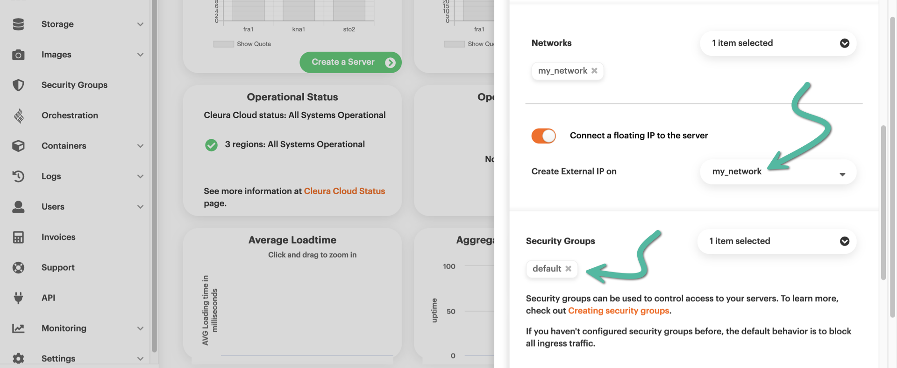
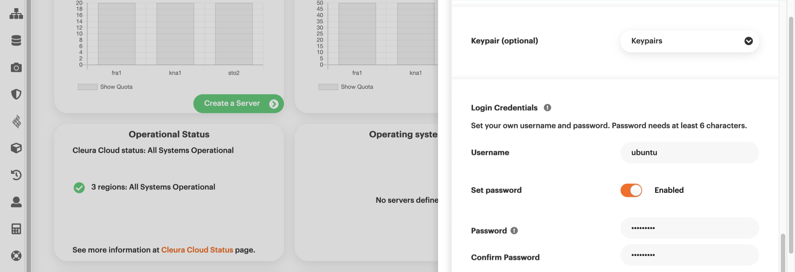
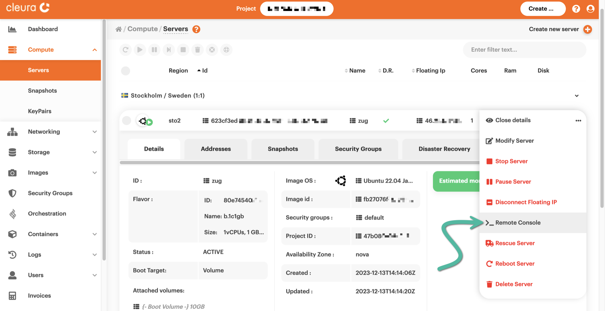
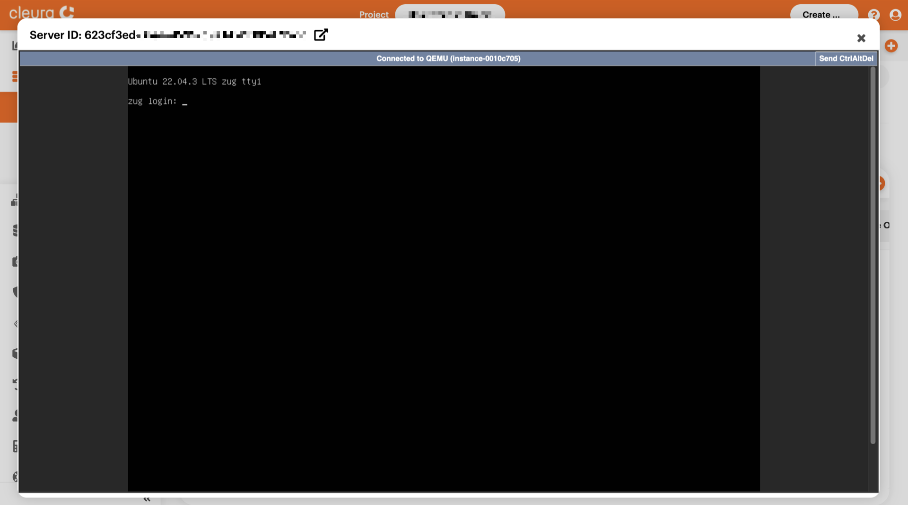

# Creating new servers

Once you have an [account in {{brand}} 
Cloud](/howto/getting-started/create-account), you can create virtual 
machines --- henceforth simply _servers_ --- using either the 
{{gui}} or the OpenStack CLI. Let us demonstrate the creation of 
a new server, following both approaches.

## Prerequisites

You need to [have at least one 
network](/howto/openstack/neutron/new-network) in the region you are 
interested in. Additionally, if you prefer to work with the OpenStack 
CLI, then make sure to properly [enable it 
first](/howto/getting-started/enable-openstack-cli). 

## Creating a server

To create a server from the {{gui}}, fire up your favorite web 
browser, navigate to the [Cleura Cloud](https://{{gui_domain}}) 
page, and log into your {{brand}} account. On the other hand, 
if you prefer to work with the OpenStack CLI, please do not forget to 
[source the RC file first](/howto/getting-started/enable-openstack-cli).

=== "{{gui}}"
	On the top right-hand side of the {{gui}}, click the 
	_Create_ button. A new pane titled _Create_ will slide into view from 
	the right-hand side of the browser window.
		
	
		
	You will notice several rounded boxes on that pane, each for 
	defining, configuring, and instantiating a different {{brand}} 
	Cloud object. Go ahead and click the _Server_ box. A new pane titled 
	_Create a Server_ will slide over. At the top, type in a name for the 
	new server and select one of the available regions.
		
	
		
	In the _Boot source_ section below, click the dropdown menu on 
	the left and make sure you select _Boot from image_, so you can choose 
	one of the readily available OS images to boot the new server off of. 
	To pick one of the images, click on the dropdown menu on the right. For 
	this how-to guide, we have chosen _ubuntu_ in general and 
	_Ubuntu 22.04 Jammy Jellyfish 20220810_ in particular.
		
	
		
	Next, make sure _Boot Target_ is set to _Volume (Recommended)_. 
	Regarding the server's CPU core count and amount of memory, set the 
	[_Flavor_](/reference/flavors) accordingly.
	The default flavor specifies a server with 1 CPU core and 1GB of RAM.
	You can start with that or select a different configuration by clicking
	the dropdown menu at the right of _Flavor_. Please note that, depending on 
	the chosen flavor, the estimated monthly cost of the server changes. (While a 
	server is shut off you are still getting charged for it, but less so.) 
	At any time, this estimated cost is displayed in the green rectangular area 
	at the top. Something else that affects the cost is the size of the root 
	device. Take a look at the _Size_ parameter below, and notice the 
	default (in 
	[gibibytes](https://en.wikipedia.org/wiki/Gigabyte#Base_2_(binary))). 
	You may leave the root device size unchanged, or modify it to be lower 
	or higher than the default.
		
	When, at a later time, you decide to delete the server, you can 
	do so but **keep** its boot volume (you may want, for example, to 
	attach the exact same volume to a new server). Just leave the _Delete 
	on termination_ option disabled if you want this kind of flexibility. 
	On the other hand, if you want your root volume to be automatically
	deleted when the server terminates, enable _Delete on termination_.
	Use this option with caution.
		
	Finally, you may enable _Disaster recovery_ for the server. If 
	you do, then daily server snapshots will be created, and you will have 
	the option for easy and fast rollups to previous snapshots. Please be 
	aware that enabling this option increases the server's monthly estimated
	cost (again, it is displayed in the green rectangular area at the top).
		
	
		
	Regarding networking, select one of the available networks to 
	attach the new server to. If you want the server accessible from the 
	Internet, do not forget to enable the _I want an external IP for my 
	server_ option. In the section below, set _Security Groups_ to 
	_default_.
		
	
		
	If you already have one or more public keys in your 
	{{brand}} Cloud account, you can now select a key to be included 
	in the `~/.ssh/authorized_keys` file of the server's default user. That 
	way, you can securely log into the remote user's account without typing 
	a password. If there are no public keys to choose from, activate the 
	_Password login enabled_ option and set a password for a specific user 
	(with a username you define).
		
	
		
	A configuration script is automatically prepared based on the 
	choices you have already made. That script runs during system boot and 
	performs housekeeping tasks like user account creation, enabling 
	acceptable authentication methods, and configuring remote package 
	repositories. Click on _Advanced Options_ to see the default script.
		
	
		
	It is now time to create your {{brand}} Cloud server; 
	click the green _Create_ button, and the new server will be readily 
	available in a few seconds.
		
	
=== "OpenStack CLI"
	An `openstack` command for creating a server may look like 
	this:
		
	```bash
	openstack server create \
		--flavor $FLAVOR_NAME \
		--image $IMAGE_NAME \
		--boot-from-volume $VOL_SIZE \
		--network $NETWORK_NAME \
		--security-group $SEC_GROUP_NAME \
		--key-name $KEY_NAME \
		--wait \
		$SERVER_NAME
	```
		
	Each variable represents a piece of information we have to look 
	for or, in the cases of `KEY_NAME` and `SERVER_NAME`, arbitrarily 
	define.
	
	Let us begin with the [_flavors_](/reference/flavors) (`FLAVOR_NAME`), which 
	describe combinations of CPU core count and memory size. Each server has a 
	distinct flavor, and to see all available flavors type:
	
	```bash
	openstack flavor list
	```
		
	You will get a pretty long list of flavors. For our demonstration,
	we suggest you go with `b.1c1gb`. A server with this particular flavor will 
	have one CPU core and one
	[gibibyte](https://en.wikipedia.org/wiki/Gigabyte#Base_2_(binary)) of 
	RAM. Go ahead and set `FLAVOR_NAME` accordingly:
		
	```bash
	FLAVOR_NAME="b.1c1gb"
	```
		
	Your server should have an image to boot off of (`IMAGE_NAME`). 
	For a list of all available images in {{brand}} Cloud, type:
		
	```bash
	openstack image list
	```
		
	This time you get a shorter list, but you can still filter for 
	images with the OS you prefer. For example, filter for Ubuntu:
		
	```bash
	openstack image list --tag "os:ubuntu"
	```
		
	Continue with the `Ubuntu 22.04 Jammy Jellyfish 20220810` image:
		
	```bash
	IMAGE_NAME="Ubuntu 22.04 Jammy Jellyfish 20220810"
	```
	
	Before you go on, decide on the capacity (in gibibytes) of the server's
	boot volume (`VOL_SIZE`). We suggest you start with 20 gibibytes:
	
	```bash
	VOL_SIZE="20"
	```
	
	You need at least one network in the region you're about to 
	create your new server (`NETWORK_NAME`). To get the names of all 
	available (internal) networks, type:
	
	```bash
	openstack network list --internal -c Name
	```
		
	```plain
	+----------------+
	| Name           |
	+----------------+
	| nordostbahnhof |
	+----------------+
	```
		
	Set the `NETWORK_NAME` variable accordingly:
	
	```bash
	NETWORK_NAME="nordostbahnhof"
	```
		
	Regarding the security group (`SEC_GROUP_NAME`), unless you 
	have already created one yourself, you will find only one per region:
	
	```bash
	openstack security group list -c Name -c Description
	```
		
	```plain
	+---------+------------------------+
	| Name    | Description            |
	+---------+------------------------+
	| default | Default security group |
	+---------+------------------------+
	```
		
	Go ahead and set `SEC_GROUP_NAME`:
		
	```bash
	SEC_GROUP_NAME="default"
	```
		
	You most likely want a server you can remotely connect to via 
	SSH without typing a password. Upload one of our public keys to your 
	{{brand}} Cloud account:
		
	```bash
	openstack keypair create --public-key ~/.ssh/id_ed25519.pub bahnhof
	```
		
	In the example above, we uploaded the public key 
	`~/.ssh/id_ed25519.pub` to our {{brand}} Cloud account and named 
	it `bahnhof`. Follow our example and do not forget to set the 
	`KEY_NAME`:
		
	```bash
	KEY_NAME="bahnhof"
	```
		
	By the way, check all uploaded public keys...
		
	```bash
	openstack keypair list
	```
		
	...and get more information regarding the one you just uploaded:
		
	```bash
	openstack keypair show bahnhof
	```
		
	You are almost ready to create your new server. Decide on a 
	name...
		
	```bash
	SERVER_NAME="zug" # just an example
	```
		
	...and then go ahead and create it:
			
	```bash
	openstack server create \
		--flavor b.1c1gb \
		--image $IMAGE_NAME \
		--boot-from-volume 20 \
		--network nordostbahnhof \
		--security-group default \
		--key-name bahnhof \
		--wait \
		zug
	```
		
	(For clarity's sake, and with the exception of `IMAGE_NAME`, we 
	used the actual values and not the variables we so meticulously set.) 
	The `--wait` parameter is optional. Whenever you choose to 
	use it, you get back control of your terminal only after the server is 
	readily available in {{brand}} Cloud.
	
	To connect to your server remotely, you need to create a floating IP
	for the external network in the {{brand}} Cloud, and then assign
	this IP to your server. First, create the floating IP: 
	
	```bash
	openstack floating ip create ext-net
	```
		
	See all floating IPs...
		
	```bash
	openstack floating ip list
	```
		
	...and assign the one you just created to your server:
		
	```bash
	openstack server add floating ip zug 198.51.100.12
	```
		
	The username of the default user account in the Ubuntu image is 
	`ubuntu`, so now you can connect to your remote server via SSH without 
	typing a password:
	
	```bash
	ssh ubuntu@198.51.100.12
	```

## Viewing information about the newly created server
=== "{{gui}}"
	From the {{gui}} you may, at any 
	time, see all servers and get detailed information regarding each one 
	of them; expand the left-hand side vertical pane, click _Compute_, then 
	_Servers_, and, in the central pane, select the region you want. 
		
	
=== "OpenStack CLI"
	To see all available servers in the region, type:
		
	```bash
	openstack server list
	```
		
	You can always get specific information on a particular server:
	
	```bash
	openstack server show zug
	```
## Connecting to the server console
=== "{{gui}}"		
	While viewing information regarding your server, you may get 
	its public IP  address (e.g., from the _Addresses_ tab) and connect to 
	it remotely. Alternatively, you may launch a web console and log in; 
	click on the three-dot icon on the right of the server header, and from 
	the pop-up menu that appears select _Remote Console_.  
		
	
		
	A new window pops up, and that's your web console to your 
	{{brand}} Cloud server. Please note that this window cannot be 
	resized but can be opened on a new browser window or tab.
		
	
=== "OpenStack CLI"
	You may have access to the web console of your server, and you need the 
	corresponding URL for it:
	
	```bash
	openstack console url show zug
	```
	
	Usage of the web console is discouraged, though. Instead,
	securely connect to your server via SSH.
